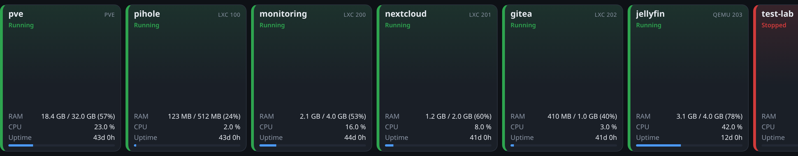
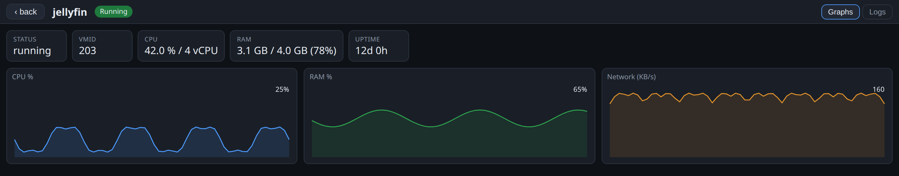
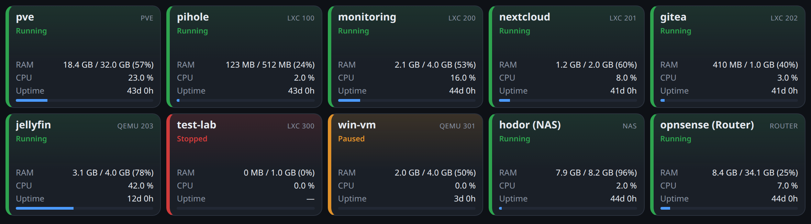

<h1 align="center">Homelab GUI</h1>

<p align="center">
  <em>A fast, touch-friendly monitoring dashboard for a Proxmox homelab,<br>
  built for an ultra-wide 1U touchscreen (1424×280) and happy on any screen.</em>
</p>

<p align="center">
  <a href="https://github.com/yves-chevallier/homelab-gui/actions/workflows/ci.yml"></a>
  <a href="LICENSE"></a>
  
  
  
</p>

---

So you racked a little 1U box with a skinny 1424×280 touchscreen on the front,
and now you want it to actually show you something useful. That's what this is.
It's a wall-of-cards dashboard for your Proxmox node: one card per LXC and VM,
plus the host itself, plus your NAS and your router. Each card is colored by
state, so a green wall means "all good" and a splash of red means "go look at
that one". Tap a card and it zooms into a full-screen view with charts and logs.

The whole thing is deliberately small. The frontend is plain HTML, CSS and
JavaScript with no build step and no framework, so you can crack open a file,
change it, and hit reload. The backend is a thin Express proxy whose only real
job is to hold your Proxmox token so it never ends up in a kiosk browser that
anyone walking past could poke at. Everything the UI shows comes through that
one proxy, which also means no CORS headaches: single origin, done.

It's built for the 1U panel first, but it is not stuck there. On a phone,
tablet or a regular monitor the same grid quietly reflows into wrapping rows, so
you can check on things from the couch too.

## Screenshots

**Grid view** on the 1U panel (1424×280). One swipeable row of status cards, the
Proxmox host first, then your guests, then the NAS and router at the end.



**Detail view.** Tap any card and it zooms up: the numbers you care about as
tiles, then CPU, RAM and network drawn straight onto a canvas from Proxmox's own
`rrddata`. Swipe down, hit `‹ back`, or press `Esc` to pop back to the grid.



**Same app, bigger screen.** Drop it on a desktop or tablet and the row becomes
a wrapping grid that scrolls vertically. Nothing to configure, it just adapts.



Those shots aren't staged mockups. They come straight out of the built-in demo
mode (`npm run demo`), which serves deterministic fake data so you can see the
whole thing without a real host. Regenerate them any time with
`npm run screenshots`.

## The short version of how it works

- **One row, colored by state.** Cards sit in a single horizontal row you swipe
  through (green for running, red for stopped, orange for paused, gray when a
  source is unreachable). Order is fixed and predictable: PVE host, then LXC/VM
  sorted by vmid, then NAS, then router.
- **Made for fingers.** Swipe the grid sideways, tap to zoom in, swipe down or
  hit back to zoom out. It's a touchscreen, so it behaves like one.
- **Real detail when you want it.** The zoomed view gives you live metrics,
  CPU/RAM/network charts from `rrddata`, an optional embedded Grafana panel, and
  the last chunk of logs pulled from Loki.
- **Your token stays home.** The Proxmox API token lives on the server. The
  browser only ever talks to the local proxy, so there's nothing sensitive to
  leak and no cross-origin nonsense to fight.
- **Responsive without trying.** Tuned for the short-and-wide 1U, but it reflows
  into a normal grid on anything taller.
- **Barely any moving parts.** Vanilla JS frontend, three backend dependencies,
  no `localStorage`, no build tooling. All state is in memory, so a reload
  always starts you clean.

## How the pieces fit

The browser polls one endpoint every three seconds. The backend fans that out to
whichever sources it needs and hands back a single tidy payload:

```
Browser (kiosk)
      │  same-origin fetch (poll 3s)
      ▼
Express backend  ──►  PVE API   https://192.168.20.2:8006  (token, cert ignored)
   (LXC 200)     ──►  Prometheus http://…:9090   (NAS / router cards)
                 ──►  Loki       http://…:3100    (detail-view logs)
                 ──►  Grafana    http://…:3000    (proxied iframe /grafana)
```

Guests and the host come from Proxmox directly. The NAS and router cards come
from Prometheus queries (because your Synology and OPNsense already export
metrics there), and the logs in the detail view come from Loki. Grafana is
optional and only shows up as an embedded panel if you want it.

## Quick start

Grab it, install, point it at your node, run it:

```sh
git clone https://github.com/yves-chevallier/homelab-gui.git
cd homelab-gui
npm install
cp .env.example .env         # then set PVE_TOKEN_ID / PVE_TOKEN_SECRET
npm start                    # http://localhost:8080
```

No token yet? Jump to [Read-only Proxmox token](#read-only-proxmox-token). Want
to run it next to your monitoring stack instead? See
[Inside LXC 200 (Docker)](#inside-lxc-200-docker-with-the-existing-stack). Just
want to poke at the UI with no infra at all? `npm run demo` and open
`http://localhost:8080`.

## What lives where

```
server/          Express backend (proxy for PVE / Prometheus / Loki / Grafana)
  config.js      reads env vars + config/cards.json
  upstream.js    PVE (self-signed cert ignored), Prometheus and Loki calls
  index.js       API routes + serves the static frontend
  demo.js        deterministic fixtures for DEMO=1
public/          frontend (vanilla HTML/CSS/JS, no CDN dependency)
config/cards.json  external cards (NAS, router) via Prometheus queries
scripts/         smoke test + screenshot generator
Dockerfile / docker-compose.yml / .env.example
```

## Backend endpoints

Everything the frontend needs is behind a handful of routes. You'll mostly care
about `/api/grid`, the one it polls:

| Route | Purpose |
|-------|---------|
| `GET /api/config` | Non-secret config for the frontend (pollMs, node, grafana) |
| `GET /api/grid` | The single aggregated response: host + guests + NAS + router |
| `GET /api/rrd/node?timeframe=hour` | PVE host time series |
| `GET /api/rrd/:type/:vmid?timeframe=hour` | Guest time series (`lxc`/`qemu`) |
| `GET /api/logs?host=<name>&limit=150` | Loki logs `{host="<name>"}` |
| `/grafana/*` | Reverse proxy to Grafana (iframe embed) |

`/api/grid` is deliberately forgiving. If one source is down or slow, that card
falls back to `unknown` and everything else still renders. A flaky NAS shouldn't
take your whole dashboard with it.

## Environment variables

Copy `.env.example` to `.env` and, at a minimum, drop in your Proxmox token.
Everything else already points at the reference setup, so tweak what doesn't
match yours.

| Variable | Default | Description |
|----------|---------|-------------|
| `PORT` | `8080` | Backend listen port |
| `POLL_MS` | `3000` | Frontend poll interval |
| `PVE_HOST` | `192.168.20.2` | Proxmox host |
| `PVE_PORT` | `8006` | Proxmox API port |
| `PVE_NODE` | `pve` | PVE node name |
| `PVE_TOKEN_ID` | (unset) | API token id (`user@realm!name`) |
| `PVE_TOKEN_SECRET` | (unset) | API token secret |
| `PROM_URL` | `http://192.168.20.50:9090` | Prometheus |
| `LOKI_URL` | `http://192.168.20.50:3100` | Loki |
| `GRAFANA_URL` | `http://192.168.20.50:3000` | Grafana (leave empty to hide the tab) |
| `LOKI_LABEL` | `host` | Loki label used to filter logs per machine |
| `DEMO` | (unset) | set to `1` for deterministic sample data, no token or live sources needed |

## Read-only Proxmox token

The dashboard only ever reads, so give it a token that can only read. Make a
dedicated user, an audit-only role (`VM.Audit` and `Sys.Audit`, plus
`Datastore.Audit` if you want storage numbers), and a token for it. Run this on
the PVE host:

```sh
# 1) dedicated user in the PVE realm
pveum user add monitor@pve

# 2) read-only (audit) role
pveum role add Monitoring -privs "VM.Audit Sys.Audit Datastore.Audit"

# 3) grant it read access over the whole tree
pveum acl modify / -user monitor@pve -role Monitoring

# 4) token WITHOUT privilege separation so it inherits the user's privileges
pveum user token add monitor@pve gui --privsep 0
```

That last command prints the secret exactly once, so grab it now:

```
┌──────────────┬──────────────────────────────────────┐
│ key          │ value                                │
├──────────────┼──────────────────────────────────────┤
│ full-tokenid │ monitor@pve!gui                      │
│ value        │ xxxxxxxx-xxxx-xxxx-xxxx-xxxxxxxxxxxx  │
└──────────────┴──────────────────────────────────────┘
```

Drop both halves into `.env`:

```
PVE_TOKEN_ID=monitor@pve!gui
PVE_TOKEN_SECRET=xxxxxxxx-xxxx-xxxx-xxxx-xxxxxxxxxxxx
```

Under the hood the backend sends `Authorization: PVEAPIToken=<id>=<secret>` and
ignores the self-signed cert on `:8006`. That cert bypass applies to the PVE
host only, nothing else.

## NAS and router cards (Prometheus)

The host and guests come from Proxmox, but your NAS and router don't live there,
so those two cards are driven by plain Prometheus queries in
[`config/cards.json`](config/cards.json). Each card can define up to five
queries: `up` (1 or 0, becomes running/stopped), `cpu` (0..1), `mem` (bytes),
`memMax` (bytes) and `uptime` (seconds).

The queries that ship here are already wired to the reference boxes. The
**Synology NAS** is scraped through `snmp_exporter` (UCD-SNMP `ssCpu*`,
HOST-RESOURCES `hrStorage*`, `sysUpTime`, label `host="hodor"`), and the
**OPNsense router** through Telegraf (`cpu_usage_idle`, `mem_used` / `mem_total`,
`system_uptime`, label `host="opnsense"`). Your metric names will probably
differ, so open the Prometheus explorer, find the real ones, and edit the file.
Nothing to break here: an empty or missing query just shows a dash, and the card
stays put.

## Embedded Grafana (optional)

If a card has a `grafana` field (they're set for the NAS and router, and you can
add one to any guest), the detail view gets a Grafana tab that loads that panel
through the `/grafana/...` proxy. For the iframe to actually render, tell Grafana
it's allowed to be embedded:

- in `grafana.ini`, set `[security] allow_embedding = true`
- to skip the login screen, set `[auth.anonymous] enabled = true` (Viewer org),
  or use public dashboard links
- point the field at something like `/grafana/d/<uid>/<slug>?kiosk&theme=dark&panelId=<n>`

Good starting dashboards: `10347` (Proxmox), `14284` (Synology), and the OPNsense
Cockpit one.

## Running it for real

### Locally

```sh
npm install
cp .env.example .env      # set the PVE token
export $(grep -v '^#' .env | xargs)   # or use your favorite env loader
npm start
# http://localhost:8080
```

### Inside LXC 200, next to the rest of your stack

If Prometheus, Loki and Grafana already run in a compose stack on that LXC, this
slots right in beside them. The provided [`docker-compose.yml`](docker-compose.yml)
reaches those three by service name and talks to the PVE host by IP. Put the
token in that stack's `.env` and bring it up:

```sh
docker compose up -d --build proxmox-gui
# http://192.168.20.50:8080
```

## Hacking on it

```sh
npm run dev         # start with --watch, restarts on save
npm run check       # syntax-check the JS and validate config/cards.json
npm test            # boot the server and confirm it serves the API + UI
npm run demo        # run with fake data (DEMO=1), no token required
npm run screenshots # regenerate docs/img/*.png with headless Playwright
```

CI runs `check` and `test` on Node 20 and 22 and builds the Docker image on
every push and pull request. It's all in
[`.github/workflows/ci.yml`](.github/workflows/ci.yml).

## Kiosk mode

To make the 1U panel show the dashboard on boot, point a full-screen browser at
it. Chromium does the job:

```sh
chromium --kiosk --incognito --noerrdialogs \
  --disable-pinch --overscroll-history-navigation=0 \
  --window-size=1424,280 http://192.168.20.50:8080
```

Since the app keeps zero state on disk (no `localStorage`, everything in memory),
a plain reload always brings it back to a clean slate. Handy for an appliance you
never really log into.

## License

MIT. Do what you like with it. See [LICENSE](LICENSE).
